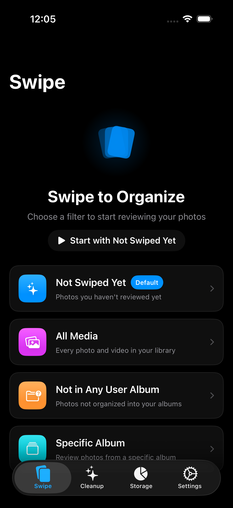
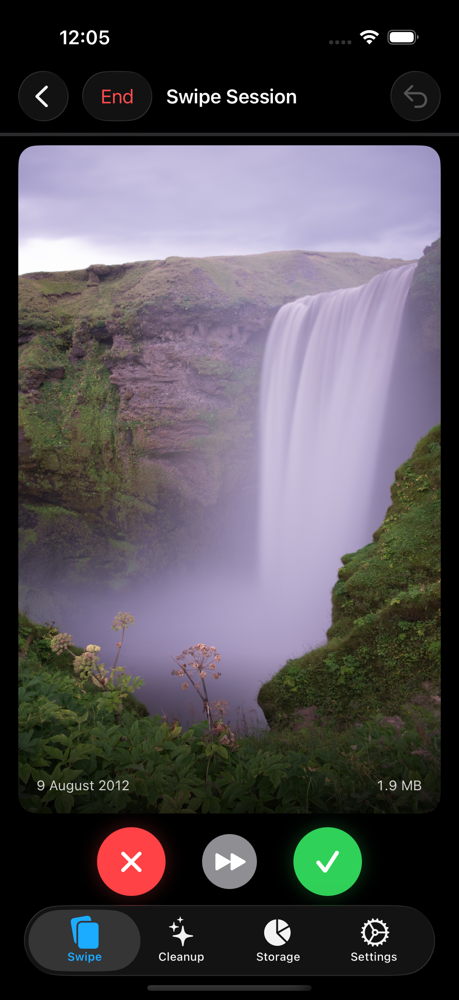
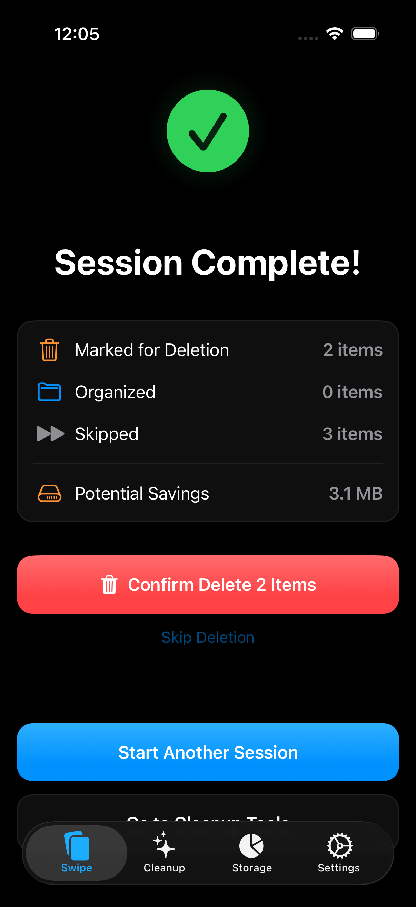
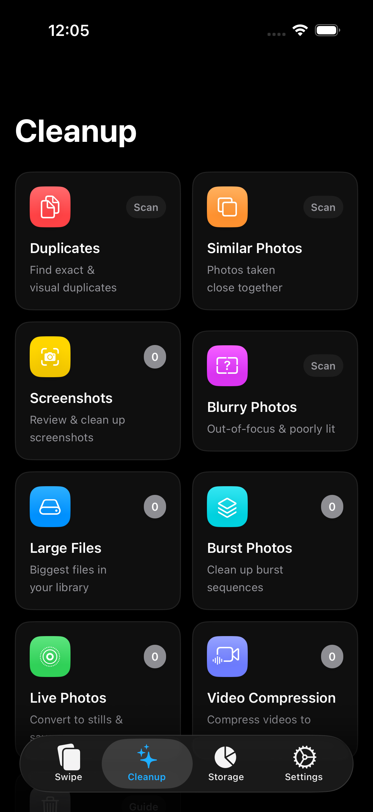
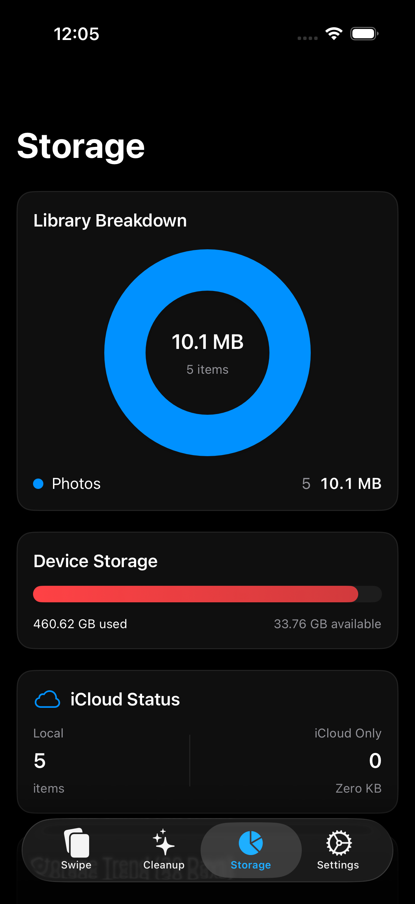

# SnapClean

A native iOS app that helps users clean up their photo library. Core UX is a Tinder-style swipe interface for reviewing media.

- **Swift/SwiftUI**, iOS 17+, iPhone only
- **No backend** — all processing on-device
- **No third-party dependencies** — Apple frameworks only
- MVVM + Actors + SwiftData architecture

## Screenshots

<p align="center">
  
  
  
  
  
</p>

## Features

- Swipe-based photo review (keep/delete)
- Duplicate & similar photo detection (SHA-256 + Vision feature prints)
- Blurry photo detection
- Screenshot, burst, and Live Photo cleanup
- Large file finder
- Video compression
- Storage dashboard

## Requirements

- Xcode 15+
- iOS 17+ device (photo library operations require a physical device)
- [XcodeGen](https://github.com/yonaskolb/XcodeGen)

## Build & Run

```bash
# Generate Xcode project from project.yml
xcodegen generate

# Build
xcodebuild -project SnapClean.xcodeproj -scheme SnapClean \
  -destination 'platform=iOS Simulator,name=iPhone 16' build
```

## Project Structure

```
SnapClean/
├── App/           # @main entry + RootView (TabView)
├── Models/        # SwiftData models + DTOs
├── Services/      # Actor-based services
├── Features/      # Feature modules (Swipe, Cleanup, Storage, Settings)
└── Shared/        # Reusable components, extensions, utilities
```

Configuration lives in `project.yml` (XcodeGen). The `.xcodeproj` is generated and not checked into version control.
